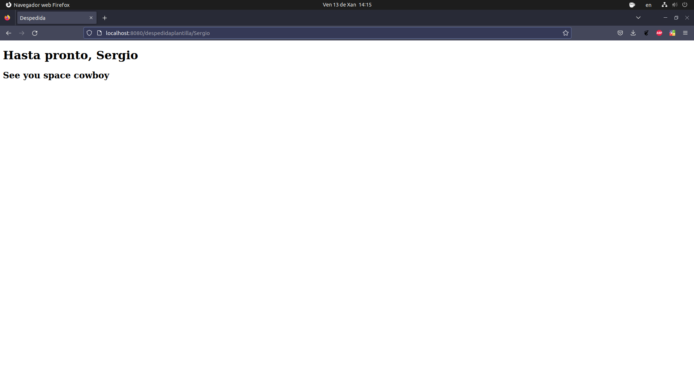
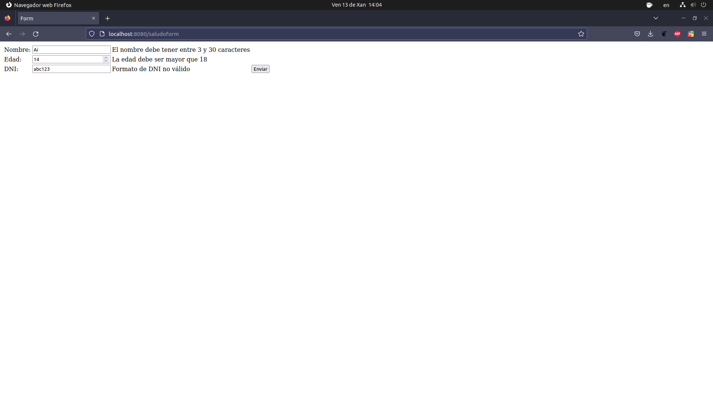
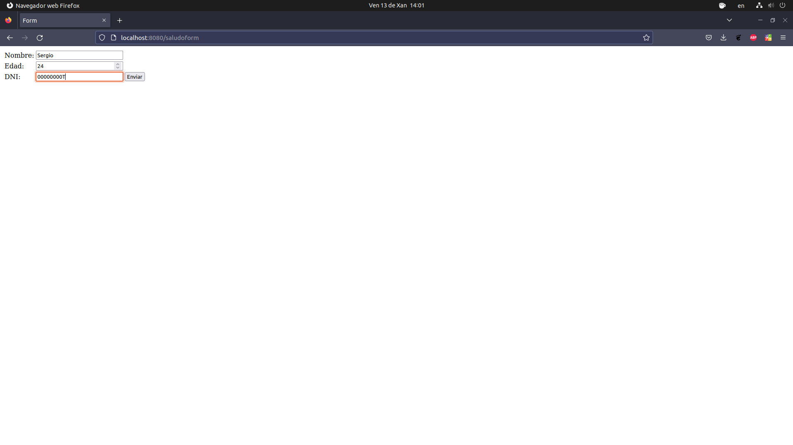
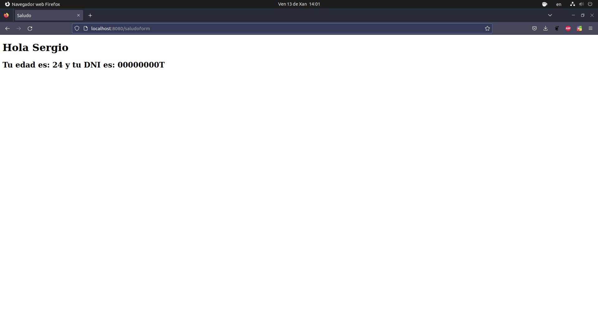
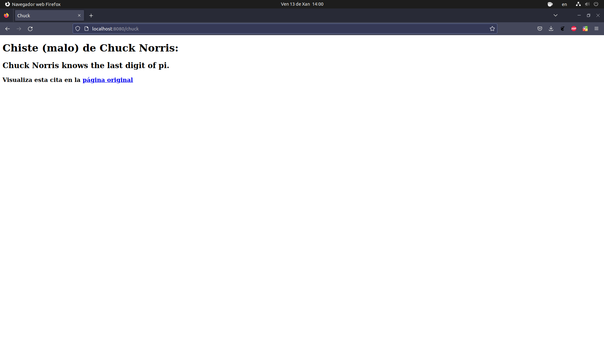
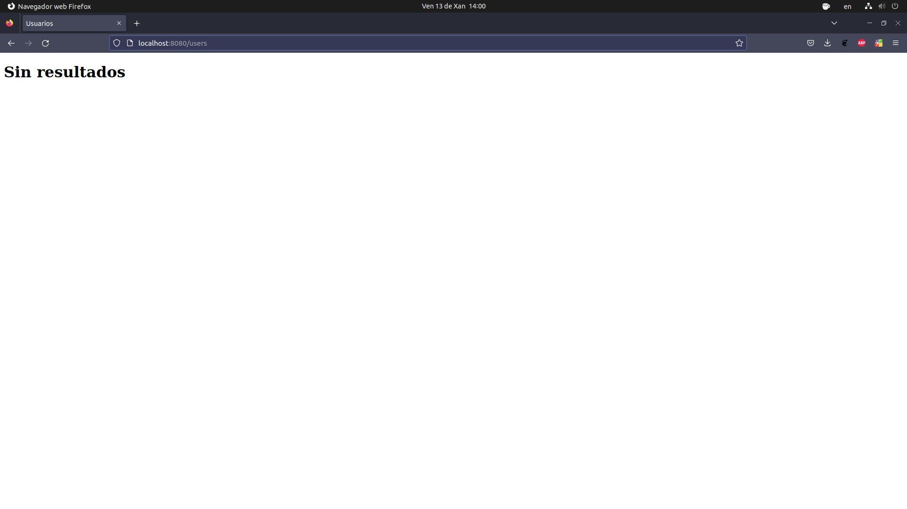
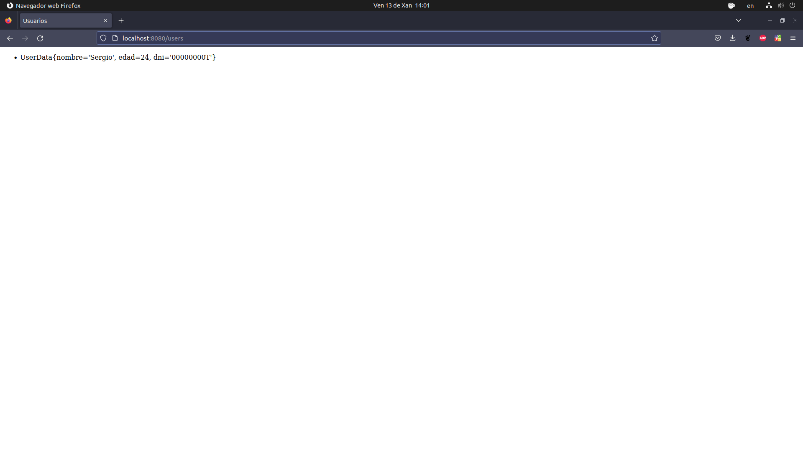
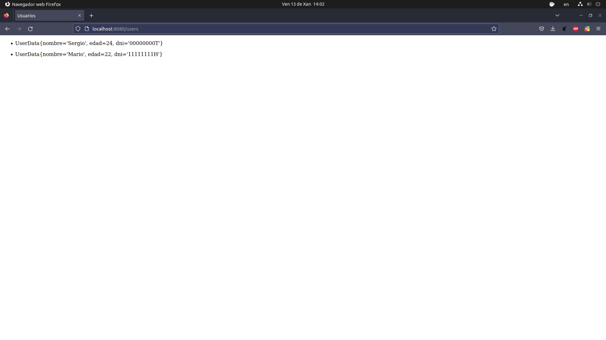

# TarefaEA.4.1. Introducción a SpringBoot

Aplicación básica usando Spring Boot y plantillas Thymeleaf.

## Comprobación do proxecto

## Validación de formularios

## Consumo de APIs con Spring Boot

## Acceso a datos con Spring Boot

Cando non existen datos persistidos, amósase a mensaxe "Sin resultados".

A introdución dun usuario válido no formulario (`/saludoform`) persiste automáticamente os seus datos, que poden ser
visualizados en (`/users`).

- [http://localhost:8080](http://localhost:8080)
- [http://localhost:8080/users](http://localhost:8080/users)
- [http://localhost:8080/saludoform](http://localhost:8080/saludoform)
- [http://localhost:8080/chuck](http://localhost:8080/chuck)

